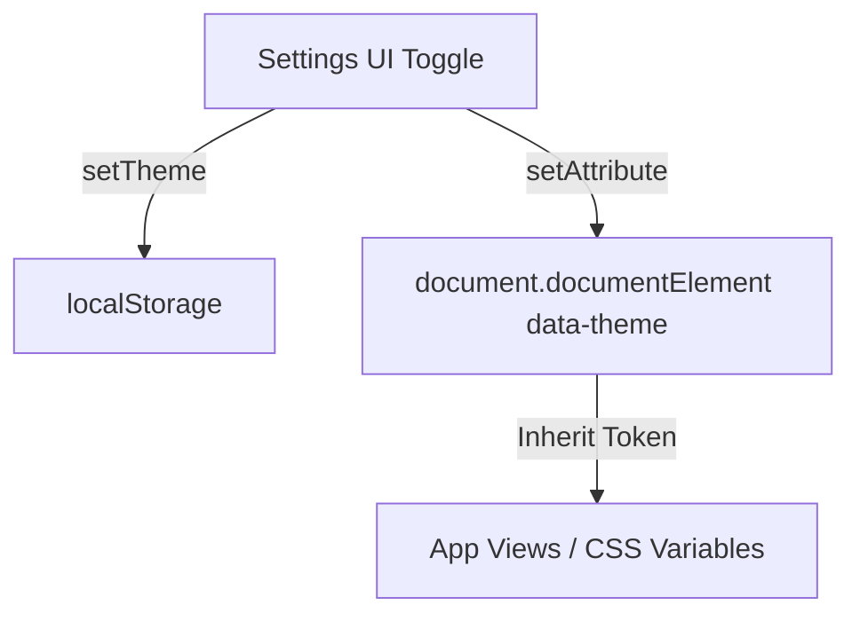

# Conversa AI Frontend Handoff Documentation

This document serves as a complete history and technical specification of the frontend UI/UX modifications, theme system standardization, and responsiveness audit.

---

## Project Overview
Conversa AI is a state-of-the-art SaaS web application providing neural speech-to-text transcribing, text-to-speech voice generation, and voice cloning capabilities. 

The objective of this visual refinement sprint was to transition the layout and style implementation into a highly polished, consistent, and standard-compliant frontend design system.

---

## UI Improvements Timeline

### 1. Logo & Sidebar Branding Update
- **What Changed:** Replaced legacy, misaligned brand elements in the sidebar header with a consistent alignment utilizing the neural voice SVG logo alongside clean Outfit-font branding.
- **Why:** The brand elements looked generic and didn't align correctly when the sidebar collapsed.
- **Files Affected:** [Sidebar.jsx](file:///c:/Users/rishi/OneDrive/Desktop/CONVERSA_AI/kdext_conversa_ai_ui/src/components/Sidebar.jsx), [Navbar.jsx](file:///c:/Users/rishi/OneDrive/Desktop/CONVERSA_AI/kdext_conversa_ai_ui/src/components/Navbar.jsx)
- **Visual Improvement:** Premium, aligned header matching SaaS benchmarks.

### 2. Sidebar Navigation & Emojis Migration
- **What Changed:** Swapped all inline legacy emojis inside sidebar nav list items with standardized SVG icons imported from the `lucide-react` library.
- **Why:** Custom emoji icons rendered inconsistently across operating systems and browsers, degrading the premium SaaS aesthetic.
- **Files Affected:** [Sidebar.jsx](file:///c:/Users/rishi/OneDrive/Desktop/CONVERSA_AI/kdext_conversa_ai_ui/src/components/Sidebar.jsx)
- **Visual/UX Improvement:** High-fidelity UI icons yielding a uniform, professional, and enterprise-grade look.

### 3. Collapsible Sidebar Animation
- **What Changed:** Redesigned the collapse toggle switch button with smooth rotation transitions (`transform: rotate(180deg)`), elevated hover states, and increased touch boundaries.
- **Why:** Expanding/collapsing the sidebar felt stiff and lacked the micro-interaction feedback found in premium applications.
- **Files Affected:** [Sidebar.jsx](file:///c:/Users/rishi/OneDrive/Desktop/CONVERSA_AI/kdext_conversa_ai_ui/src/components/Sidebar.jsx), [index.css](file:///c:/Users/rishi/OneDrive/Desktop/CONVERSA_AI/kdext_conversa_ai_ui/src/index.css)
- **Visual/UX Improvement:** Engaging, responsive drawer collapsible triggers.

### 4. Landing Page UI & Statistics Count-Up
- **What Changed:** Enhanced typography weights, margins, and card grids on the landing page. Configured a React intersection observer-based `AnimatedStat` component to run animated count-up numbers.
- **Why:** Static statistics made the landing page feel static. The count-up animations draw attention to business proof metrics.
- **Files Affected:** [LandingPage.jsx](file:///c:/Users/rishi/OneDrive/Desktop/CONVERSA_AI/kdext_conversa_ai_ui/src/views/LandingPage.jsx)
- **Visual/UX Improvement:** Dynamic, interactive content flow that engages users instantly on scroll.

### 5. Dashboard Icon & Card Standardization
- **What Changed:** Unified all visual icons across the primary action cards to match the sidebar's vector language (replacing hardcoded emojis). Standardized padding, shadow effects, and font sizing.
- **Why:** Visual styles varied widely between different dashboard cards.
- **Files Affected:** [Dashboard.jsx](file:///c:/Users/rishi/OneDrive/Desktop/CONVERSA_AI/kdext_conversa_ai_ui/src/views/Dashboard.jsx)
- **Visual/UX Improvement:** A visually clean, cohesive dashboard area.

### 6. Settings Page Switches Redesign
- **What Changed:** Redesigned checkbox toggles (like "Reduce Motion") by coding a physical sliding thumb toggle knob (`sliderThumb` and `sliderThumbChecked` elements) inside inline CSS parameters.
- **Why:** Checkboxes rendered as blank pills on mobile/tablet because inline styles lacked pseudo-element support.
- **Files Affected:** [Settings.jsx](file:///c:/Users/rishi/OneDrive/Desktop/CONVERSA_AI/kdext_conversa_ai_ui/src/views/Resources/Settings.jsx)
- **Visual/UX Improvement:** Fluid, interactive iOS-style sliding switches.

---

## Responsive Improvements

### 1. Viewport Height Adjustments (`100dvh`)
- **What Changed:** Swapped all global `.app-container`, `.sidebar`, and modal overlays height parameters from `100vh` to `100dvh`.
- **Why:** On mobile browsers (Safari, Chrome, Firefox), the browser's address bar overlay covers the bottom section of the screen, clipping key controls like the chat input area. `dvh` recalculates dynamically when the address bar hides or expands.
- **Files Affected:** [index.css](file:///c:/Users/rishi/OneDrive/Desktop/CONVERSA_AI/kdext_conversa_ai_ui/src/index.css), [Dashboard.jsx](file:///c:/Users/rishi/OneDrive/Desktop/CONVERSA_AI/kdext_conversa_ai_ui/src/views/Dashboard.jsx), [History.jsx](file:///c:/Users/rishi/OneDrive/Desktop/CONVERSA_AI/kdext_conversa_ai_ui/src/views/History.jsx)

### 2. Dashboard Grid & Table Reflow
- **What Changed:** Eliminated forced horizontal scroll wrappers around dashboard modules. The API Keys card was restructured to wrap elements, and key columns stack vertically on devices under 500px.
- **Why:** Multi-column tables forced the main layout to clip or overflow, introducing unwanted horizontal scrolling.
- **Files Affected:** [Dashboard.jsx](file:///c:/Users/rishi/OneDrive/Desktop/CONVERSA_AI/kdext_conversa_ai_ui/src/views/Dashboard.jsx), [index.css](file:///c:/Users/rishi/OneDrive/Desktop/CONVERSA_AI/kdext_conversa_ai_ui/src/index.css)

### 3. Sidebar Tablet Auto-Collapsing
- **What Changed:** Added a window resize listener hook inside `App.jsx` that automatically collapses the sidebar if the viewport falls below the 1024px tablet breakpoint.
- **Why:** Keep maximum workspace area readable on landscape and portrait tablet viewports.
- **Files Affected:** [App.jsx](file:///c:/Users/rishi/OneDrive/Desktop/CONVERSA_AI/kdext_conversa_ai_ui/src/App.jsx)

### 4. Dialog & Scroll Overlays
- **What Changed:** Fixed centering and overflow constraints inside settings overlays and chat suggestion cards. Replaced hardcoded vertical heights with flexbox `margin: auto 0` vertical fallbacks.
- **Why:** Suggestions and modal bodies were clipped on small phone viewports.
- **Files Affected:** [Chat.jsx](file:///c:/Users/rishi/OneDrive/Desktop/CONVERSA_AI/kdext_conversa_ai_ui/src/views/Chat.jsx), [index.css](file:///c:/Users/rishi/OneDrive/Desktop/CONVERSA_AI/kdext_conversa_ai_ui/src/index.css)

---

## Theme System

The theme system has been completely restructured to use HTML `data-theme` selectors and global CSS custom properties (variables) instead of manual Javascript inline overrides.

### Theme Colors & Architecture
- **Light Theme (Default / `:root`):** A modern, crisp interface using `#f6f9fe` main background, `#ffffff` card backgrounds, slate text (`#0f172a`), and clean subtle borders (`rgba(15, 23, 42, 0.08)`).
- **Dark Theme (`[data-theme="dark"]`):** Deep dark canvas (`#0f172a`), slate card surfaces (`#1e293b`), slate text (`#f8fafc`/`#94a3b8`), and translucent border variables.
- **High Contrast Theme (`[data-theme="contrast"]`):** Enterprise-grade accessibility mode styled similarly to GitHub Dark High Contrast. True black canvas (`#000000`), `#121212` elevated surfaces, white primary text (`#ffffff`), light-gray secondary text (`#cbd5e1`), and pure yellow (`#ffff00`) reserved exclusively for borders, outlines, active elements, buttons, and state indicators. All decorative blurred mesh gradients are disabled.
- **Transitions:** Added a 0.3s cubic ease transition filter globally to background colors, text, and borders to prevent sudden visual flashing.
- **Theme Previews:** The previews in `Settings.jsx` dynamically render in White, Dark Slate, and Pitch Black/Yellow, matching their visual styles.

---

## Design Standards

Developers extending the Conversa AI codebase must adhere to the following design system tokens:

- **Icon Library:** Strictly utilize `lucide-react` vector components. Do not hardcode raw emojis for navigation or indicators.
- **Spacing:** Main container margins use `var(--container-padding)`. The sidebar items use standard padding `14px 16px`.
- **Typography:** Outfit font-family for headings and title banners; Inter font-family for paragraphs and body content.
- **Borders & Shadows:** Card structures use `var(--border-radius)` (12px). Box shadows utilize theme-aware `var(--shadow-color)`.
- **Color Mapping:** Derive all colors dynamically from semantic tokens:
  - `--bg-main` / `--bg-card` / `--bg-navbar` / `--bg-footer`
  - `--text-primary` / `--text-secondary` / `--text-muted`
  - `--border-color` / `--border-subtle` / `--border-hover` / `--border-focus`
  - `--primary` / `--primary-light` / `--primary-glow`
  - `--bg-overlay` (for modals and overlays)

---

## Files Modified

| File Path | Description of Refinements |
| :--- | :--- |
| `src/index.css` | Defined Light, Dark, High Contrast design tokens. Added transitions, layout media overrides, and responsive card properties. |
| `src/App.jsx` | Added theme auto-load from `localStorage` on init, and window resize listeners for collapsing tablet sidebars. |
| `src/components/Navbar.jsx` | Replaced hardcoded translucent values with theme variables (`bg-navbar`, `bg-card`, etc.). |
| `src/components/Footer.jsx` | Standardized footer background, borders, and text colors to dynamically morph across Light, Dark, and Contrast modes. |
| `src/views/Resources/Settings.jsx` | Fixed toggle switches, integrated `data-theme` attribute switches, re-ordered previews (Light first, Dark, Contrast), and added visual option cards. |
| `src/views/LandingPage.jsx` | Added numerical count-up statistics hooks and mapped text colors to theme variables. |
| `src/views/Dashboard.jsx` | Restructured the API keys section to reflow cleanly on mobile viewports and standardized modal overlay heights. |
| `src/views/History.jsx` | Configured modal overlay backdrops to inherit theme parameters and standard heights. |
| `src/views/Chat.jsx` | Fixed CSS layout centering for empty state cards to prevent top layout clipping on mobile viewports. |

---

## Future Recommendations
1. **System Preferences Sync:** Add an option to settings allowing users to sync themes automatically with the user's OS style.
2. **Chart Customization:** Integrate theme custom properties directly into chart rendering libraries (e.g. ChartJS/Recharts) to swap bar and line graph colors dynamically.
3. **Contrast Adjustments:** Provide standard font scaling sliders in Settings to support multiple text size adjustments cleanly.

---

## Important Notes
> [!IMPORTANT]  
> All refinements implemented during this process were strictly restricted to the **Frontend UI/UX layer**. 
> - No backend logic, database layers, or API contracts were modified.
> - No routing mechanics or navigation state handlers were changed.
> - No business logic or authentication hooks were altered.
